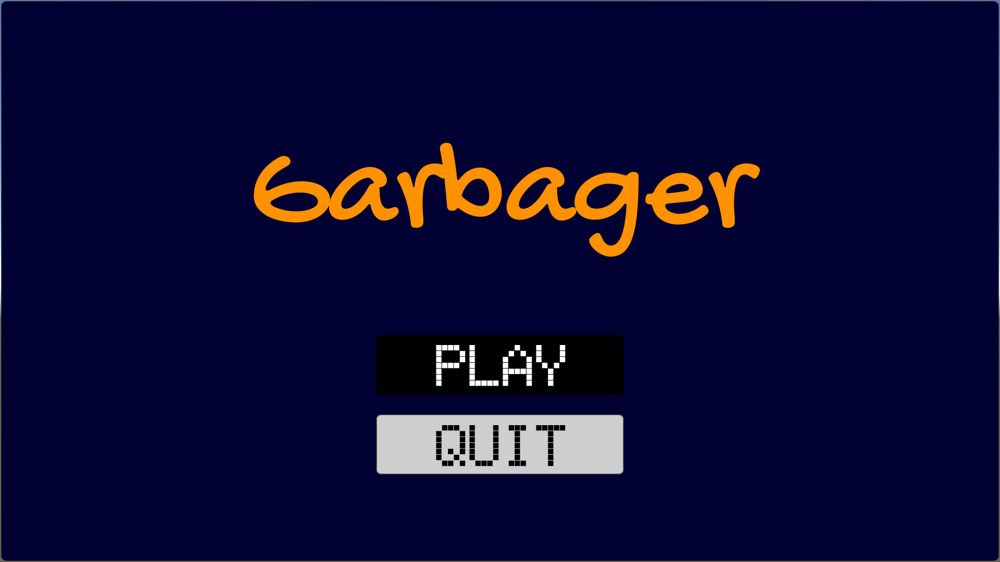
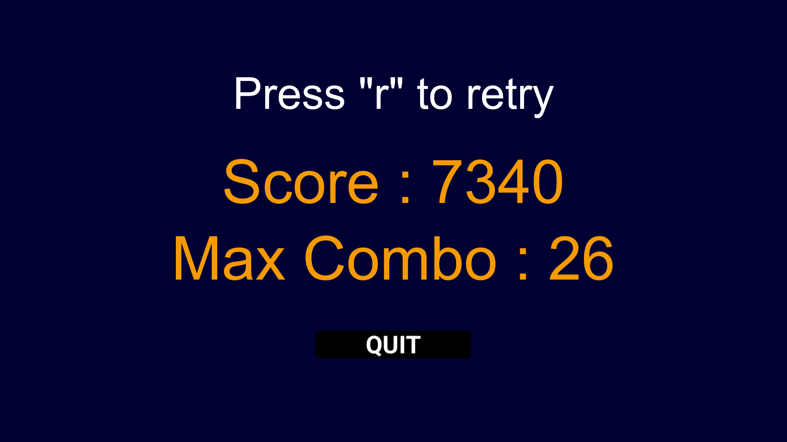

# **Garbager**

**Garbager** adalah sebuah permainan yang bertujuan untuk mengedukasi para pemainnya untuk menyortir sampah berdasarkan dengan jenis-jenisnya dan membuang sesuai dengan tempat sampah yang telah disediakan. Pada versi ini hanya terdapat 1 level yaitu Easy dengan 4 macam jenis sampah diantaranya adalah **Elektronik**, **Plastik**, **Organik**, dan **Kaca**. Tempat sampahnya pun terdapat 4 warna, untuk warna <a style="color:green;font-weight:bold">Hijau</a> untuk sampah <a style="color:green;font-weight:bold">Organik</a>, <a style="color:blue;font-weight:bold">Biru</a> untuk sampah <a style="color:blue;font-weight:bold">Elektronik</a>, <a style="color:red;font-weight:bold">Merah</a> untuk sampah <a style="color:red;font-weight:bold">Plastik</a>, dan <a style="color:yellow;font-weight:bold">Kuning</a> untuk sampah <a style="color:yellow;font-weight:bold">Kaca</a>.


# **Developer**


| Nama                 | NIM       | Role |
| -------------------- | --------- | ---- |
| Muhammad Zulkifli    | G64170033 |      |
| Alfian Hamam Akbar   | G64170040 |      |
| Fahreza Ikhsan Hafiz | G64170077 |      |

# **How to play**
```text
Tombol yang bisa ditekan ada 4 sesuai dengan banyaknya jenis sampah yaitu :
1.  "Q" untuk membuang ke arah tempat sampah berwarna Hijau
2.  "W" untuk membuang ke arah tempat sampah berwarna Biru
3.  "O" untuk membuang ke arah tempat sampah berwarna Merah
4.  "P" untuk membuang ke arah tempat sampah berwarna Kuning

Jika sampah yang dilempar sesuai dengan tempat sampahnya, maka poin akan bertambah sebesar
sisa waktu saat ini dan akan dikalikan sesuai combo yang akan terus bertambah jika terus
menerus membuang sampah sesuai tempatnya, tapi jika sampah yang dilempar tidak sesuai dengan
tempat sampahnya, poin akan dikurangi sebanyak 10 dan combo akan direset menjadi 0 kembali.
```

# **Goal**


    Tujuan dari game ini adalah meraih poin sebesar-besarnya dalam waktu yang telah diberikan ( 30 detik)


# **Gameplay Screenshots**






# **Tech-Stack**

Pada pengembangan game ini kami menggunakan *Game Engine* **Unity** dan bahasa pemrograman **C#**.

| Nama Software        | Fungsi      |
| -------------------- | ----------- |
| *Unity 2019.2.12f1*  | Game Engine |
| *Visual Studio Code* | Code Editor |
| *Visual Studio 2019* | Code Editor |
